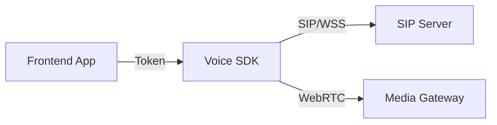

# Voice SDK

The Voice SDK provides a high-level, developer-friendly abstraction over **JsSIP** and **WebRTC**, designed specifically for integrating voice capabilities into enterprise web applications like CRMs and ERPs.

## Key Features

<CardGroup cols={2}>
  <Card title="Leader Election" icon="users">
    Automatically coordinates between multiple open tabs to ensure only one active SIP registration exists.
  </Card>
  <Card title="Smart Audio Management" icon="waveform-lines">
    Handles ringtones, remote audio streams, and device switching out of the box.
  </Card>
  <Card title="Resilient Connectivity" icon="plug">
    Built-in auto-reconnection logic and event handling for network drops.
  </Card>
  <Card title="Type-Safe API" icon="code">
    Written in TypeScript with complete type definitions for seamless development.
  </Card>
</CardGroup>

## Architecture

The SDK acts as a bridge between your frontend application and a SIP infrastructure. It handles:

1.  **Authentication**: Exchanges your app's organizational token for SIP credentials.
2.  **Signaling**: Manages WebSocket connections to the SIP Registrar/Proxy.
3.  **Media**: Manages WebRTC PeerConnections and audio elements.

